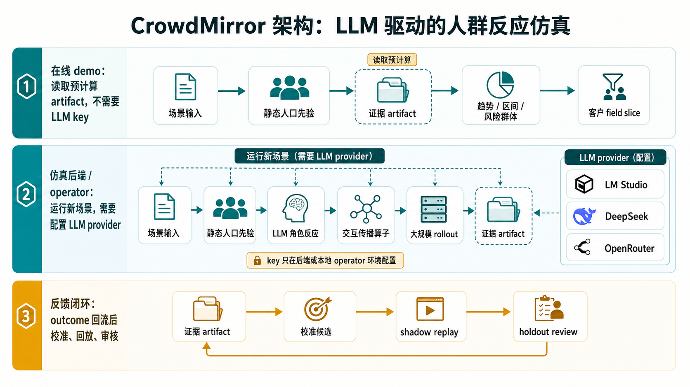

# 人群反应趋势与风险区间模拟器

CrowdMirror 是一个面向企业试用的公开数据验证版原型，用于在政策、价格、权益或服务规则变更发布前，模拟人群反应趋势、可信数值区间、风险分布、异常群体和机制解释。

它不定位为“精准预测系统”，而是定位为：

> 基于静态人口先验、公开数据验证、虚拟人群反应和交互传播的发布前风险评估工具。

## 适合谁用

- 政策研究机构：评估政策发布前后的大众反应方向、风险群体和沟通重点。
- 企业经营团队：评估价格、权益、服务规则变化可能带来的投诉、流失或舆情风险。
- 产品和策略团队：在正式上线前比较多个方案，提前识别高风险人群和异常反应。
- 研究团队：查看公开数据验证、校准门禁、失败边界和可审计 artifact。

## 5 分钟上手

1. 打开宣传页，先理解产品能做什么、不能承诺什么：
   [https://magiciandu.github.io/crowdmirror/demo/promo.html](https://magiciandu.github.io/crowdmirror/demo/promo.html)
2. 点击宣传页里的“打开产品 demo”，或直接打开：
   [https://magiciandu.github.io/crowdmirror/demo/](https://magiciandu.github.io/crowdmirror/demo/)
3. 先看页面顶部的状态标签，确认报告、研究支撑、产品就绪和 API 合同都处于 guarded 状态。
4. 再看四个核心指标：趋势方向、风险区间、风险排序、误报率。
5. 下滑查看异常群体、机制解释、证据边界和阻断声明。
6. 如果要准备企业试用，打开“客户 field slice 校验”面板，按字段模板准备伪匿名数据。浏览器端只做本地预览校验，不上传客户数据。

更详细的操作说明见 [docs/USER_GUIDE.md](docs/USER_GUIDE.md)。

## 产品 demo 怎么看

产品 demo 不是营销落地页，而是 source-backed report UI。页面会读取仓库里的 JSON artifact，并把可说和不可说的边界展示出来。

建议按这个顺序阅读：

1. **顶部状态**：看报告、研究支撑、产品就绪、API 是否 ready guarded。
2. **核心指标卡片**：快速判断趋势方向、风险区间、风险排序和误报率。
3. **异常群体**：查看哪些 segment 可能出现静态先验漏报或高风险反应。
4. **机制解释**：理解风险是由价格压力、服务不确定性、群体敏感度还是传播机制触发。
5. **R12 迁移验证**：查看公开数据上的次级证据、正向信号和仍被阻断的结论。
6. **客户试运行面板**：查看从场景输入、群体先验、运行闸门、报告导出到 outcome review 的闭环。
7. **阻断声明**：确认系统没有承诺精确单点预测、客户 field validation 或自动上线校准更新。

## 看懂核心指标

- **趋势方向**：判断反应会向上、向下还是保持稳定。适合回答“风险大致会不会变高”。
- **风险区间**：给出可信数值范围，而不是一个确定点估计。适合回答“最可能落在哪个范围内”。
- **风险排序**：比较哪些群体或场景更值得优先关注。适合安排灰度、沟通和补偿优先级。
- **误报率**：衡量系统把低风险错判为高风险的代价。误报高时，只能作为诊断信号，不能默认决策。
- **异常群体**：指出静态人口先验可能漏掉的群体。它是产品价值重点，但必须和误报边界一起看。
- **机制解释**：说明为什么某个群体或场景可能产生风险，用于辅助业务讨论，不等同于因果证明。

## 当前能力

- 公开数据测试：当前 R12 gate 已允许 `public_data_effectiveness_claim_allowed=true`，表示可对外做“公开数据测试有效”的受限声明。
- 趋势与区间：输出趋势方向、风险区间、风险排序、静态先验漏报恢复、误报控制和决策价值指标。
- 离线校准闭环：支持 outcome 反馈后的结构化更新候选、shadow replay、holdout review 和人工确认流程。
- 证据边界：所有 Product 展示绑定 artifact、source refs、blocked claims 和 runtime guard。
- 企业试用路径：可先用公开数据版演示价值，再决定是否进入企业 field validation。

## 一次企业试用需要准备什么

当前公开 demo 可以直接浏览，不需要账号、不需要安装、不上传客户数据。

如果要进入企业试用，需要准备一份伪匿名 field slice，用于后续离线验证：

- 至少 10 个 cases。
- 必需字段：`case_id`、`segment_id`、`scenario_id`、`prediction_share_or_score`、`observed_outcome`、`outcome_timestamp`、`customer_approval_reference`。
- 不要包含手机号、邮箱、身份证、姓名、地址等直接个人标识。
- 每条记录都要有客户审批引用，确保数据回流经过授权。
- 数据通过 intake 后，只允许进入 revalidation、feedback candidate、shadow replay 和 holdout review，不会自动打开 runtime default。

模板位置：

`experiments/results/r12_customer_field_slice_handoff_package/r12-customer-field-slice-template-current-001.csv`

## 什么时候需要 LLM key

分三种使用模式：

| 使用模式 | 是否需要 LLM key | 说明 |
| --- | --- | --- |
| 在线宣传页 / 产品 demo | 不需要 | GitHub Pages 只读取已生成的公开 artifact，不运行 LLM，也不上传客户数据。 |
| 企业试用浏览报告和做 field slice 预览 | 不需要 | 浏览器端只做静态展示和本地字段校验，不读取任何 API key。 |
| 研发或 operator 重新运行 LLM 仿真、候选更新、TextGrad / prompt optimizer | 需要 | key 只配置在本地 shell、服务器或离线 operator 环境，不能放进浏览器、README、artifact 或提交记录。 |

当前代码支持 OpenAI-compatible provider：

- 本地 LM Studio：不需要真实 key，但要先启动本地模型服务，默认地址通常是 `http://127.0.0.1:1234/v1`。代码会使用占位 key `lm-studio`。
- DeepSeek：需要在 shell 里配置 `DEEPSEEK_API_KEY`。
- OpenRouter：需要在 shell 里配置 `OPENROUTER_API_KEY`。

zsh 示例：

```bash
export DEEPSEEK_API_KEY="替换成你的 DeepSeek key"
export OPENROUTER_API_KEY="替换成你的 OpenRouter key"
```

运行脚本时通过参数选择 provider endpoint 和模型，例如：

```bash
--base-url https://api.deepseek.com --model deepseek-v4-flash
```

或使用本地 LM Studio：

```bash
--base-url http://127.0.0.1:1234/v1 --model openai/gpt-oss-20b
```

注意：公开 demo 不会、也不应该要求用户输入 LLM key。真实客户试用如果需要重新仿真，应由部署方或 operator 在受控后端环境配置 key。

## 架构：LLM 驱动，但不是浏览器里跑 LLM

真实运行新场景的人群模拟需要 LLM。LLM 负责场景语义理解、虚拟人角色反应、机制假设和反馈后的候选更新；静态人口先验和结构化传播算子负责把这些语义信号扩展到更大人群，并产出趋势、区间、风险排序和异常群体。



关键边界：

- 在线 demo 只读取预计算 artifact，不需要 LLM key。
- 运行新场景、重新仿真或做 prompt / feedback update 优化时，需要在后端或本地 operator 环境配置 LLM provider。
- key 不进入浏览器、不写进 README、不写进 artifact、不提交到 GitHub。
- 大规模仿真不是每个体每一步都直接调用 LLM，而是“LLM 语义生成 + 静态人口先验 + 交互传播算子 + 可审计指标”的混合架构。

## 不能承诺

- 不承诺精确单点预测。
- 不宣称客户 field validation 已完成。
- 不把校准更新默认自动上线。
- 不开启 runtime default；当前 `runtime_default_allowed=false`。

## 在线预览

- 首页：[https://magiciandu.github.io/crowdmirror/](https://magiciandu.github.io/crowdmirror/)
- 宣传页：[https://magiciandu.github.io/crowdmirror/demo/promo.html](https://magiciandu.github.io/crowdmirror/demo/promo.html)
- 产品 demo：[https://magiciandu.github.io/crowdmirror/demo/](https://magiciandu.github.io/crowdmirror/demo/)
- 证据 JSON：[r12-product-support-gate-current-001.json](https://magiciandu.github.io/crowdmirror/experiments/results/r12_product_support_gate/r12-product-support-gate-current-001.json)

## 本地运行

本地只需要一个静态文件服务器：

```bash
python3 -m http.server 8088 --bind 127.0.0.1
```

然后打开：

- 宣传页：`http://127.0.0.1:8088/demo/promo.html`
- 产品 demo：`http://127.0.0.1:8088/demo/`

如果页面显示 artifact 加载失败，通常是没有从仓库根目录启动 server，或者 `experiments/results/` 下的证据文件没有同步完整。

## 开发者验证

```bash
.venv/bin/python -m pytest -q
node --check demo/app.js
node --check demo/promo.js
```

本次 GitHub Pages 链接和用户指南相关测试：

```bash
.venv/bin/python -m pytest tests/test_r6_product_frontend_demo.py tests/test_readme_user_guide.py -q
```

## 关键文档

- [docs/USER_GUIDE.md](docs/USER_GUIDE.md)：面向试用用户的操作指南。
- [docs/active-spec.md](docs/active-spec.md)：当前研发主线和证据边界。
- [docs/CURRENT_STATE.md](docs/CURRENT_STATE.md)：当前状态、guard、gap 和历史结论。
- [docs/superpowers/specs/2026-06-26-r12-outcome-supervised-causal-interaction-operator-spec.md](docs/superpowers/specs/2026-06-26-r12-outcome-supervised-causal-interaction-operator-spec.md)：R12 方法和产品支撑合同。

## 关键证据 artifact

- `experiments/results/r12_product_support_gate/r12-product-support-gate-current-001.json`
- `experiments/results/r6_product_customer_value_report/r6-product-customer-value-report-current-001.json`
- `experiments/results/r12_real_source_validation_execution_packet/r12-real-source-validation-execution-packet-current-001.json`

## 常见问题

**它能预测一个准确数字吗？**

不能。系统输出趋势方向、可信数值区间、风险排序和异常群体，不承诺精确单点预测。

**公开 demo 能上传企业数据吗？**

不能。GitHub Pages 是静态页面，当前只做本地浏览器预览和字段校验，不接收、不保存、不上传客户数据。

**用户使用时需要配置 LLM key 吗？**

只是浏览在线宣传页和产品 demo 不需要。只有研发或 operator 要重新运行 LLM 驱动仿真、候选更新或 prompt optimizer 时，才需要在本地 shell 或后端环境配置 `DEEPSEEK_API_KEY` / `OPENROUTER_API_KEY`。本地 LM Studio 模式通常不需要真实 key。

**为什么页面里有很多 blocked 或 guarded？**

这是刻意保留的证据边界。没有真实客户 field slice 或独立 target outcome 之前，系统不会把离线校准候选自动升级成默认生产方法。

**企业试用的价值在哪里？**

价值在于发布前识别趋势方向、风险区间、异常群体和机制解释，并在真实 outcome 回流后形成可审计的校准闭环，而不是承诺一次性精确预测。

## 研发背景

项目早期从“Calibrated Generative Agents for CSS”出发，探索过 TextGrad、LCDU、DCL-PRS、R6/R7/R12 等路线。当前对外主线已经收敛为 Product-first：

- 产品定位：人群反应趋势与风险区间模拟器。
- 研究支撑目标：验证交互仿真是否改善趋势判断、区间校准、风险排序、异常群体识别和决策价值。
- 当前边界：公开数据上有 guarded 正向证据；客户 field validation 与 runtime default 仍需真实 outcome 回流后验证。
